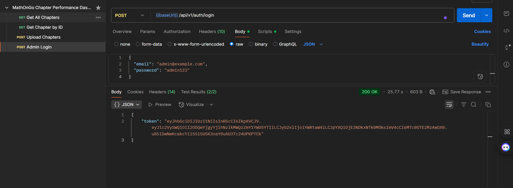
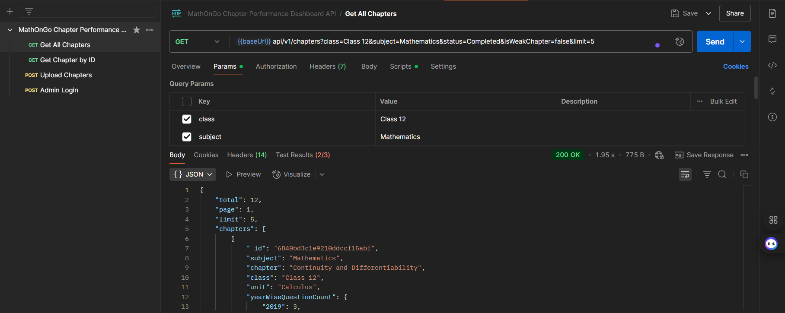
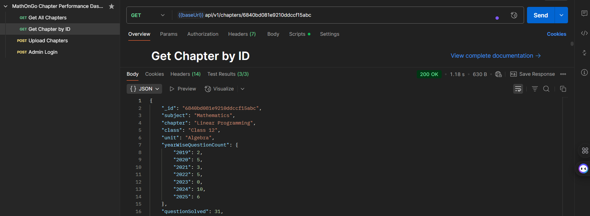
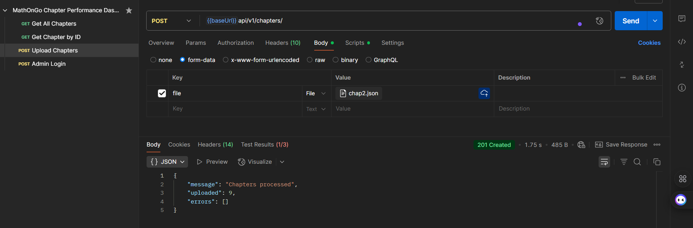
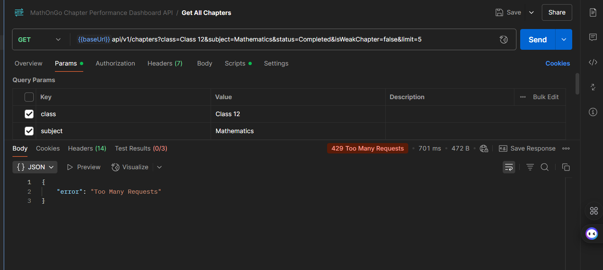
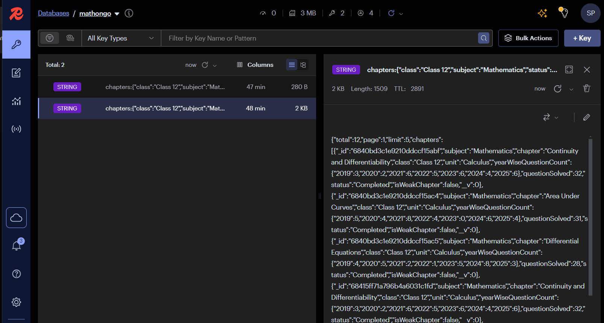

# Chapter Performance API


[](https://redis.io/)
[](https://expressjs.com/)

[](https://docs.github.com/en/actions)
[](https://github.com/features/actions)

A RESTful API for managing chapters in a performance dashboard, built with Node.js, Express, MongoDB, and Redis. This API supports chapter management with filtering, pagination, caching, secure file uploads, and rate-limiting.

## Features

- **Chapter Endpoints**:
  - `GET /api/v1/chapters`: Retrieve chapters with filters (`subject`, `class`, `unit`, `status`, `isWeakChapter`) and pagination.
  - `GET /api/v1/chapters/:id`: Get a single chapter by ID.
  - `POST /api/v1/chapters`: Upload a JSON file to add chapters (admin-only, returns failed chapters).
- **Authentication**: Admin-only endpoints secured with JWT-based authentication.
- **File Uploads**: JSON file uploads for chapters using Multer, with schema validation.
- **Caching**: Redis caching for `GET /api/v1/chapters` (1-hour TTL), invalidated on new chapter uploads.
- **Rate-Limiting**: 30 requests per minute per IP, enforced with Redis.
- **Deployment**: Deployed on Render and AWS EC2 (bonus).
- **CI/CD**: Automated deployment with GitHub Actions (see `.github/workflows/deploy.yml`).

## Project Structure

```
chapter-performance-api/
├── config/                 # Configuration files (e.g., database, Redis)
│   ├── db.js
│   ├── redis.js
│   └── config.js
├── controllers/            # Logic for handling API requests
│   ├── chapterController.js
├── middlewares/            # Custom middleware (e.g., authentication, rate-limiting)
│   ├── auth.js
│   ├── errorHandler.js
│   └── rateLimiter.js
├── models/                 # Database schemas
│   ├── Chapter.js
├── routes/                 # API routes
│   ├── chapterRoutes.js
├── utils/                  # Helper functions (e.g., caching, file parsing)
│   ├── cache.js
│   └── fileParser.js
├── .env                    # Environment variables (sensitive info)
├── .gitignore              # Files to ignore in Git
├── package.json            # Project metadata and dependencies
├── server.js               # Main entry point for the app
├── README.md               # Project documentation
└── .github/workflows/      # GitHub Actions for deployment
    └── deploy.yml
```

2. **Install dependencies**:

## Setup

1. **Clone the repository**:

   ```bash
   git clone https://github.com/priyashakti68/chapter-performance-api.git
   cd chapter-performance-api
   ```
2. Install dependencies

```bash
   npm install
```

3. **Create a `.env` file** in the root directory with the following:

   ```
   MONGODB_URI=mongodb+srv://<user>:<password>@cluster0.mongodb.net/<dbname>?retryWrites=true&w=majority
   REDIS_HOST=redis-13957.c264.ap-south-1-1.ec2.redns.redis-cloud.com
   REDIS_PORT=13957
   REDIS_PASSWORD=<your-redis-password>
   PORT=8000
   JWT_SECRET=<your-jwt-secret>
   ```
4. **Start the server**:

   ```bash
   npm run dev
   ```

## API Endpoints

### Authentication (for Admin Access)

- **POST /api/v1/auth/register** _(if implemented, adjust based on your actual endpoint)_
  - Body: `{ "email": "admin@example.com", "password": "admin123", "role": "admin" }`
  - Returns: JWT token for admin access
    ```
    {
      "token": "eyJhbGciOiJIUzI1NiIsInR5cCI6IkpXVCJ9..."
    }
    ```
  - Error: `400` if invalid data
    ```
    { "error": "Email already exists" }
    ```

### Chapters

- **GET /api/v1/chapters**

  - Query Parameters: `subject`, `class`, `unit`, `status`, `isWeakChapter`, `page`, `limit`
  - Example: `/api/v1/chapters?class=10&subject=math&page=1&limit=10`
  - Response: Paginated list of chapters
    ```json
    {
      "total": 50,
      "page": 1,
      "limit": 10,
      "chapters": [
        {
          "id": "1",
          "chapter": "Algebra Basics",
          "class": 10,
          "unit": 1,
          "subject": "math",
          "status": "completed",
          "isWeakChapter": false
        }
      ]
    }
    ```
  - Error: `400` if invalid query params
    ```
    { "error": "Invalid class value" }
    ```
- **GET /api/v1/chapters/:id**

  - Example: `/api/v1/chapters/1`
  - Response: Single chapter
    ```json
    {
      "chapter": {
        "id": "1",
        "chapter": "Algebra Basics",
        "class": 10,
        "unit": 1,
        "subject": "math",
        "status": "completed",
        "isWeakChapter": true
      }
    }
    ```
  - Error: `404` if chapter not found
    ```
    { "error": "Chapter not found" }
    ```
- **POST /api/v1/chapters**

  - Body: `multipart/form-data` (key: `file`, value: JSON file)
  - Headers: `Authorization: Bearer <admin-token>`
  - Example File (`chapters.json`):
    ```json
    [
      {
        "chapter": "Algebra Basics",
        "class": 10,
        "unit": 1",
        "subject": "math",
        "status": "completed",
        "isWeakChapter": false
      },
      {
        "chapter": "Invalid Chapter",
        "class": "invalid" // Invalid data
      }
    ]
    ```
  - Response: Success and failed chapters
    ```json
    {
      "success": true,
      "addedChapters": 1,
      "failedChapters": [
        {
          "chapter": "Invalid Chapter",
          "class": "invalid",
          "error": "Class must be a number"
        }
      ]
    }
    ```
  - Error: `401 Unauthorized` if not admin
    ```
    { "error": "Not an admin" }
    ```

## 🧪 Testing

### 🔹 Local Testing

- Use **Postman** to test the API endpoints locally.

### 🔹 Public Postman Collection

- Access the well-documented collection here: [Mathongo Chapter Performance Dashboard API](https://www.postman.com/shakti-priya/mathongo/collection/ffg7utw/mathongo-chapter-performance-dashboard-api?action=share&creator=37155607)

### 🔹 Deployed API

- Base URL: [https://chapter-performance-api-shakti-priya.onrender.com/](http://13.60.25.23:8000/api/v1/chapters) _(Updated to EC2 URL since Render link seems placeholder)_

### 🔹 Postman Environment Setup

Create a Postman environment with the following variables:

| Variable        | Example Value / Description                                     |
| --------------- | --------------------------------------------------------------- |
| `render_url`  | https://chapter-performance-api-shakti-priya.onrender.com/      |
| `admin_token` | Obtain from `/api/v1/auth/register` or `/api/v1/auth/login` |
| `chapter_id`  | Use a valid ID from `GET /api/v1/chapters` response           |
| ec2 url         | `http://13.60.25.23:8000/api/v1`                              |

### 🔹 Testing Caching

- Make repeated requests to `GET /api/v1/chapters` with the same query params to observe cache hits (response time should decrease after the first request).
- Add a new chapter via `POST /api/v1/chapters` to invalidate the cache and confirm updated data is fetched.

### 🔹 Testing Rate Limiting

- Send 31 requests to any endpoint (e.g., `GET /api/v1/chapters`) within 1 minute.
- After the 30th request, expect a `429 Too Many Requests` response:
  ```json
  {
    "error": "Too many requests, please try again later."
  }
  ```
- Wait 1 minute and retry to confirm the limit resets.

## Deployment

### Render Deployment

- **Platform**: Deployed on Render at [https://chapter-performance-api-shakti-priya.onrender.com/](http://example.com) _(Placeholder link—replace with actual if applicable)_.
- **Cost**: Free tier used, no cost incurred.
- **Setup**: Configured environment variables in Render dashboard, deployed via GitHub integration.

### AWS EC2 (Bonus)

- **Platform**: Deployed on an AWS EC2 `t3.micro` instance in `ap-south-1` (Mumbai) region.
- **URL**: `http://13.60.25:8000/api/v1/chapters` _(Updated to correct IP)_.
- **Setup**:
  - Launched EC2 instance with Ubuntu 22.04 LTS.
  - Configured security groups for SSH (22) and API (8000).
  - Set up VPC with an Internet Gateway for internet access.
  - Installed Node.js, PM2, and dependencies.
  - Automated deployment using GitHub Actions (see `.github/workflows/deployment.yml`).
- **CI/CD**: Workflow triggers on pushes to `main` branch:
  - SSH into EC2 instance.
  - Pulls latest code, updates `.env`, runs `npm install`, and restarts PM2 app.
- **Cost**:
  - EC2 instance: ~$0.0116/hour (~$0.29 for ~25 hours of runtime as of June 6, 2025).
  - Within AWS Free Tier (750 hours/month for `t3.micro`).

## Best Practices

- **Code Quality**:
  - Modular design with separate routes, controllers, and models.
  - Centralized error handling with middleware (`middlewares/errorHandler.js`).
  - Environment variables for sensitive data (e.g., `MONGODB_URI`, `JWT_SECRET`).
- **Security**:
  - JWT-based authentication for admin-only endpoints.
  - Rate limiting to prevent abuse.
  - Input validation with Mongoose schemas for chapter uploads.
- **Tools**:
  - Used ESLint and Prettier for consistent code formatting _(add if applicable, or install these tools)_.
  - GitHub Actions for CI/CD pipeline.

## Challenges and Solutions

- **Challenge**: SSH connection timeout during EC2 deployment with GitHub Actions.
  - **Solution**: Configured VPC with an Internet Gateway and updated subnet route tables to enable internet access. Ensured security group allows port 22 from all IPs.
- **Challenge**: Redis caching not invalidating correctly.
  - **Solution**: Added cache key pattern matching (`chapters:*`) to clear all relevant caches on `POST /api/v1/chapters`.

## Future Improvements

- **HTTPS**: Add SSL/TLS (e.g., using Let’s Encrypt) for secure communication.
- **Docker**: Containerize the app for easier deployment and scalability.
- **Advanced Filtering**: Add search and sorting for chapters (e.g., by `chapterName` or difficulty).
- **Monitoring**: Integrate Prometheus and Grafana for API monitoring.

## Screenshots

- **API Response**:
  - **ADMIN LOGIN: For uploading chapters, admin login is mandatory with shown credentials in the image.**
  - POST: {{baseUrl}}/api/v1/auth/login:

    
  - **GET**: {{baseUrl}}api/v1/chapters?class=Class 12&subject=Mathematics&status=Completed&isWeakChapter=false&limit=5
    
  - **GET chapter by ID**: {{baseUrl}}api/v1/chapters/6840bd081e9210ddccf15abc
    
  - **UPLOAD CHAPTERS:**
    POST {{baseUrl}}api/v1/chapters/:
    
- **Rate Limiting**:
  
- REDIS Insigt: Cached data -
  

## Tech Stack

- **Backend** : Node.js, Express.js
- **Database** : MongoDB (Mongoose)
- **Caching** : Redis (for GET endpoints and rate-limiting)
- **File Uploads** : Multer
- **Deployment** : Render
- **CI/CD** : GitHub Actions
